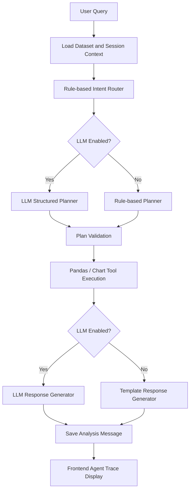

# InsightFlow

## Project Overview

InsightFlow is a full-stack data analysis AI agent platform. Users can upload
CSV/Excel datasets, create analysis sessions, ask natural language questions,
and receive schema-aware analysis results generated by a LangGraph/Pandas
workflow with optional LLM planning and response generation.

## Tech Stack

- FastAPI
- PostgreSQL
- SQLAlchemy
- Alembic
- React
- Vite
- TypeScript
- Tailwind CSS
- LangGraph
- Pandas

## Agent Architecture

The current agent keeps all data execution inside deterministic Python tools.
LLM calls are optional and only used for structured planning and final response
wording. If LLM configuration is disabled, missing, or invalid, the agent falls
back to rule-based behavior.



## Agent Version History

| Version | Capability |
|---|---|
| v0.9 | Minimal React frontend foundation |
| v1.0 | Rule-based LangGraph/Pandas agent with deterministic tools |
| v1.1 | Optional LLM planner and response generator with rule-based fallback |
| v1.2 | Agent trace, frontend plan/tool/chart display, and architecture documentation |

## Current Agent Scope

- Schema questions
- Dataset overview
- Basic aggregation
- Basic statistics
- Correlation
- Chart generation
- LLM-assisted planning
- LLM-assisted response generation
- Rule-based fallback
- Session persistence

## Out of Scope

- No multi-agent orchestration yet
- No sandbox code execution yet
- No LLM-generated Python execution yet
- No SQL agent yet
- No AutoML yet
- No long-term vector memory yet

## Local Development Notes

PostgreSQL runs through Docker:

```powershell
docker start insightflow-postgres
```

Backend runs on FastAPI:

```powershell
cd backend
..\.venv\Scripts\python.exe -m uvicorn app.main:app --reload
```

Backend URL:

```text
http://localhost:8000
```

Frontend runs on Vite React:

```powershell
cd frontend
npm install
npm run dev
```

Frontend URL:

```text
http://localhost:5173
```

If local `node` is unavailable, run the frontend with Docker:

```powershell
cd frontend
docker run -it --rm `
  -p 5173:5173 `
  -v ${PWD}:/app `
  -w /app `
  node:24-alpine `
  sh -c "npm run dev -- --host 0.0.0.0"
```

LLM configuration is optional. If disabled or not configured, the agent falls
back to rule-based planning and template responses.

```text
LLM_ENABLED=false
LLM_PROVIDER=openai_compatible
LLM_API_KEY=
LLM_MODEL=deepseek-v4-flash
LLM_BASE_URL=https://api.deepseek.com
LLM_TIMEOUT_SECONDS=30
```
